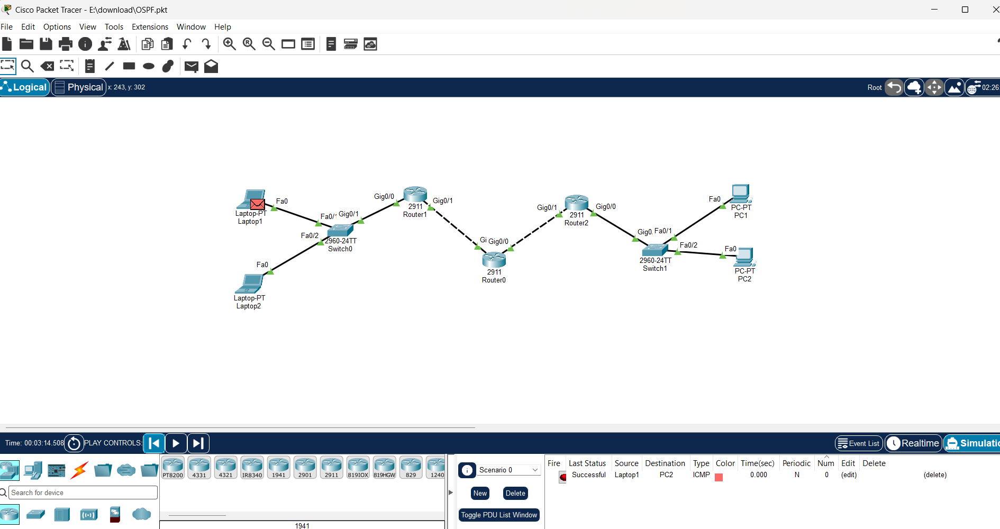

 # 🌐 Enterprise OSPF Network Topology

## 📌 Project Overview

A simulated multi-router enterprise network built using **Cisco Packet Tracer**, implementing **OSPF (Open Shortest Path First)** routing protocol, IPv4 subnetting, and device inter-connectivity.

## 🛠 Topology Details

- **Routers:** 3x Cisco 2911 Routers configured with Single-Area OSPF (Area 0).

- **Central Router (Router0):** Configured with a `Loopback0` interface to serve as a stable **OSPF Router-ID** and a reliable virtual interface for management testing.

- **Switches:** 2x Cisco 2960 Switches.

- **Protocols Used:** OSPF Area 0, ICMP, IPv4 Addressing.

## 🖼 Network Diagram

## 🔐 Credentials (Default Lab Access)
For testing and verification purposes, all network devices share standard lab credentials:
- **Enable Secret / Password:** `cisco`
## 🎯 Verification & Testing

- Ping tested between `Laptop1` and `PC2` through multiple router hops.

- Successful end-to-end communication verified via simulation mode. 
